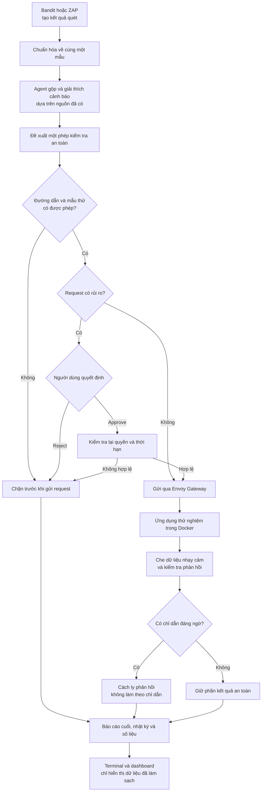

# Kiến trúc Project Sentinel

## Hệ thống làm gì?

Project Sentinel gộp kết quả quét, giải thích cảnh báo, đề xuất phép kiểm tra an
toàn và lưu báo cáo. Code quyết định đường dẫn và cần người dùng đồng ý.

## Luồng xử lý

Sơ đồ có ba điểm dừng chính: yêu cầu nằm ngoài danh sách cho phép, người dùng
chọn Reject, hoặc phê duyệt không còn hợp lệ. Chỉ nhánh hợp lệ mới đi qua Envoy
đến ứng dụng. Phản hồi quay về luôn được kiểm tra trước khi ghi báo cáo.

| Bước | Việc thực hiện | Kết quả |
|---|---|---|
| 1. Nhận dữ liệu | Đọc JSON mới từ Bandit hoặc ZAP | Bản sao và mã SHA-256 |
| 2. Chuẩn hóa | Đưa các công cụ quét về cùng một mẫu | `normalized-findings.json` |
| 3. Phân tích | Gộp cảnh báo giống nhau và tra kho kiến thức | Báo cáo JSONL có nguồn |
| 4. Đề xuất | Chọn một phép kiểm tra có sẵn | Mã chức năng và mẫu thử |
| 5. Kiểm tra | Xác nhận loại yêu cầu HTTP, đường dẫn và dữ liệu gửi | Cho phép, cần duyệt hoặc chặn |
| 6. Phê duyệt | Hiện đầy đủ yêu cầu để người dùng chọn | Approve hoặc Reject |
| 7. Gửi yêu cầu | Gửi qua Envoy, không gọi thẳng ứng dụng | Biên nhận đã làm sạch |
| 8. Lập báo cáo | Gộp kết quả từng bước | Báo cáo cuối và số liệu |

Phản hồi HTTP không thể tạo yêu cầu mới. AI không nhận API key, địa chỉ gốc hay
dữ liệu gửi tùy ý.

Code chọn sẵn địa chỉ chạy:

- chạy trên máy: `http://localhost:8080`;
- chạy trong Compose: `http://envoy:8080`.

## Các đường dẫn API hiện hành

Envoy là cổng vào duy nhất của API thử nghiệm. Keycloak chỉ mở cổng `8081` trên
máy để cấp token trong lab.

| Loại | Đường dẫn | Quyền truy cập | Mục đích |
|---|---|---|---|
| `GET`, `HEAD` | `/`, `/ui`, `/ui/*` | Công khai | Mở giao diện. |
| `GET` | `/health` | Công khai | Kiểm tra sẵn sàng. |
| `GET` | `/.well-known/oauth-protected-resource` | Công khai | Mô tả OAuth. |
| `GET` | `/api/users` | Token có `users:read` | Đọc dữ liệu mẫu. |
| `GET` | `/api/admin` | Token có `admin:read` | API quản trị mẫu; công cụ kiểm thử không được gọi. |
| `GET` | `/api/test/status` | API key của công cụ | Kiểm tra trạng thái. |
| `GET` | `/api/test/prompt-injection` | API key của công cụ | Trả nội dung giả lập để thử bộ lọc. |
| `POST` | `/api/test/validate` | API key và phê duyệt khi cần | Kiểm dữ liệu mẫu, không lưu dữ liệu. |

Ba đường dẫn `/api/test/*` chỉ nhận mẫu có sẵn; yêu cầu khác bị chặn. Envoy bỏ
API key trước khi chuyển đến ứng dụng.

## Quy tắc an toàn

- Reject, phê duyệt hết hạn hoặc không khớp đều dừng trước khi gửi.
- Sau Approve, danh sách cho phép được kiểm lại.
- Yêu cầu không tự chuyển hướng và bị giới hạn thời gian, tốc độ, kích thước.
- Dữ liệu nhạy cảm được che trước khi gửi AI hoặc ghi nhật ký.
- Phản hồi đáng ngờ bị cách ly, không lưu bản thô.
- Lỗi được đổi thành mã ngắn, không lưu chi tiết hệ thống.
- HTTP 200 chỉ cho biết đường dẫn đã trả lời, không chứng minh có lỗ hổng.

## Kết quả được lưu

Mỗi lần chạy có một thư mục riêng. Các file chính gồm:

- `pipeline-events.jsonl`: từng bước và thời gian chạy;
- `security-analysis.jsonl`: các nhóm cảnh báo có nguồn;
- `final-report.json`: kết quả cuối;
- `manifest.json`: mã SHA-256 của các file.

## Docker, CI và giao diện

Compose chạy Keycloak, API, `authz-service`, Envoy và `runner`.

CI dùng Bandit Low làm dữ liệu, Bandit High để chặn phát hành và ZAP quét thụ
động từ `/health`. Kết quả được kiểm định dạng và SHA-256 trước khi tải lên.

Giao diện chỉ phát lại dữ liệu sạch; không giữ API key hay Approve thật.

